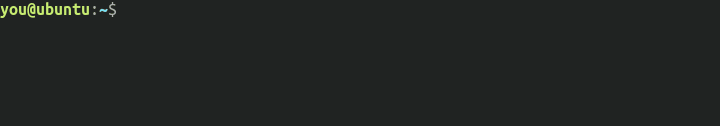

# bread

> CLI byte stream conversion tool in various formats

## About



bread is a cross-platform command-line tool useful for converting from and to a stream of:
- raw bytes
- ascii characters
- binary, hexadecimal or other numeric base representation of bytes

For more info about supported formats see 
```
bread --help
```

## Getting Started

### Prerequisites

bread is cross-platofrm, coded in Rust; you need to have a valid [Rust](https://rustup.rs/) installation.
Nightly version would be required for running benchmarks.

### Build from sources

1. clone this repository
2. build with cargo:
```
cargo build --release
```
binary will be in ```target/release/bread```


## Usage

Usage: bread [OPTIONS]

Options:
  -i, --input INPUT
  -o, --output OUTPUT

   Possible values for INPUT and OUTPUT are:
   - raw:   raw byte
   - bin:   binary representation (g.e. '00001101')
   - hex:   hexadecimal representation (g.e. 'a4')
   - ascii: ASCII characters (g.e. '!')
   - N:     base N representation (note: make sure to provide required number of digits per each byte, pad with heading 0s) 

   [default: ascii]

  -h, --help
          Print help information (use `-h` for a summary)

  -V, --version
          Print version information


## License

This project is licensed under the **GNU General Public License v3**.

See [LICENSE](LICENSE) for more information.

## Acknowledgements

- [clap](https://github.com/clap-rs/clap)
- [amazing-github-template](https://github.com/dec0dOS/amazing-github-template)
- [terminalizer](https://github.com/faressoft/terminalizer)
